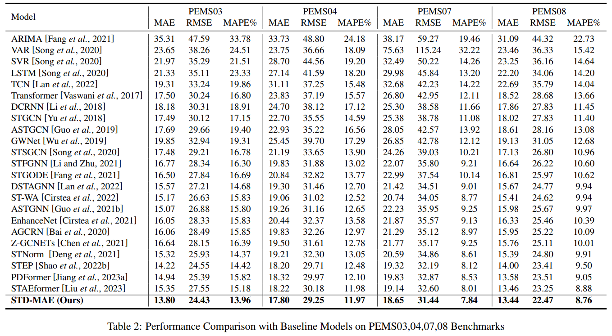
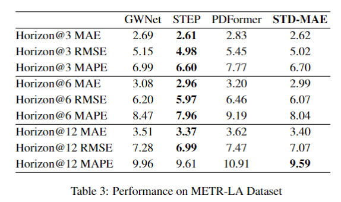
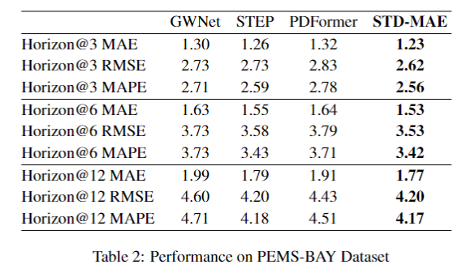

statement
On this framework, this article inherits and innovates. Subsequent researchers are required to include this citation


## Google Scholar
**Due to the modification of STD-MAE's title, you can simply search for "STD-MAE" in Google Scholar to get our article.**
## Citation
```
@article{gao2023spatio,
  title={Spatio-Temporal-Decoupled Masked Pre-training for Traffic Forecasting},
  author={Gao, Haotian and Jiang, Renhe and Dong, Zheng and Deng, Jinliang and Song, Xuan},
  journal={arXiv preprint arXiv:2312.00516},
  year={2023}
}
```



METR-LA             |  PEMS-BAY
:-------------------------:|:-------------------------:
  |  

## 💿 Dependencies

### OS

Linux systems (*e.g.* Ubuntu and CentOS). 

### Python

The code is built based on Python 3.9, PyTorch 1.13.0, and [EasyTorch](https://github.com/cnstark/easytorch).
You can install PyTorch following the instruction in [PyTorch](https://pytorch.org/get-started/locally/). 

[Miniconda](https://docs.conda.io/en/latest/miniconda.html) or [Anaconda](https://www.anaconda.com/) are recommended to create a virtual python environment.

We implement our code based on [BasicTS](https://github.com/zezhishao/BasicTS/tree/master).

### Other Dependencies

```bash
pip install -r requirements.txt
```


## Getting started

### Download Data

You can download data from [BasicTS](https://github.com/zezhishao/BasicTS/tree/master) and unzip it.

### Preparing Data


- **Pre-process Data**

You can pre-process all datasets by


    cd /path/to/your/project
    bash scripts/data_preparation/all.sh

Then the `dataset` directory will look like this:

```text
datasets
   ├─PEMS03
   ├─PEMS04
   ├─PEMS07
   ├─PEMS08
   ├─raw_data
   |    ├─PEMS03
   |    ├─PEMS04
   |    ├─PEMS07
   |    ├─PEMS08
   ├─README.md
```

### Pre-training on S-MAE and T-MAE

```
cd /path/yourproject
```

Then run the folloing command to run in Linux screen.

```
screen -d -m python stdmae/run.py --cfg='stdmae/TMAE_PEMS03.py' --gpus='0' 

screen -d -m python stdmae/run.py --cfg='stdmae/TMAE_PEMS04.py' --gpus='0'

screen -d -m python stdmae/run.py --cfg='stdmae/TMAE_PEMS07.py' --gpus='0' 

screen -d -m python stdmae/run.py --cfg='stdmae/TMAE_PEMS08.py' --gpus='0'

screen -d -m python stdmae/run.py --cfg='stdmae/SMAE_PEMS03.py' --gpus='0' 

screen -d -m python stdmae/run.py --cfg='stdmae/SMAE_PEMS04.py' --gpus='0'

screen -d -m python stdmae/run.py --cfg='stdmae/SMAE_PEMS07.py' --gpus='0' 

screen -d -m python stdmae/run.py --cfg='stdmae/SMAE_PEMS08.py' --gpus='0'
```


### Downstream Predictor

After pre-training , copy your pre-trained best checkpoint to `mask_save/`.
For example:


```bash
cp checkpoints/TMAE_200/064b0e96c042028c0ec44856f9511e4c/TMAE_best_val_MAE.pt mask_save/TMAE_PEMS04_864.pt
cp checkpoints/SMAE_200/50cd1e77146b15f9071b638c04568779/SMAE_best_val_MAE.pt mask_save/SMAE_PEMS04_864.pt
```

Then run the predictor as :

```
screen -d -m python stdmae/run.py --cfg='stdmae/AGCRN_PEMS03_V10.py' --gpus='0' 

screen -d -m python stdmae/run.py --cfg='stdmae/AGCRN_PEMS04_V10.py' --gpus='0' 

screen -d -m python stdmae/run.py --cfg='stdmae/AGCRN_PEMS07_V10.py' --gpus='0'

screen -d -m python stdmae/run.py --cfg='stdmae/AGCRN_PEMS08_V10.py' --gpus='0' 
```


* To find the best result in logs, you can search `best_` in the log files.


